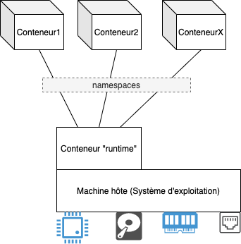
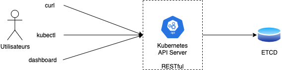
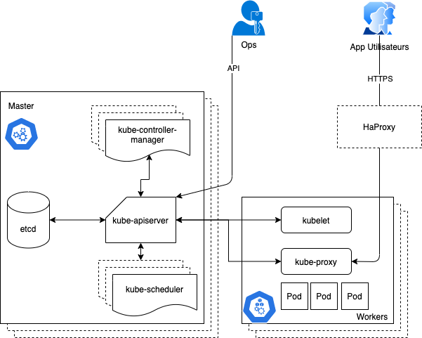

# Image

Un ensemble de fichiers et repertoires construit au dessus d'un mini-noyaux linux. C'est une encapsule d'une application sous une forme portable et facile à déployer. L'image contient tous les fichiers que l'application a besoin pour fonctionner correctement.

Lors de l'execution sur une machine, image devient un conteneur, un conteneur est une instance d'une image.

Pour construire une image, il faut écrire un fichier, un descripteur, communement appelé Dockerfile. D'autres outils sont aussi disponible pour construire une image.

Voici un exemple d'un Dockerfile :

```
FROM nginx:alpine
MAINTAINER Gégé Rasolo
COPY index.html /usr/share/nginx/html/index.html
```

Une image un ensemble des couches et construit à partir d'une image. Dans l'exemple ci-dessus, on part de l'image "nginx:alpine" qui est disponible sur Internet, qui elle est basée sur une autre image "alpine" et ainsi de suite.

Si on souhaite construire une image à partir de zero, on utilise l'instruction "FROM scratch", ceci ordonne à l'outil (daemon Docker) de construire à partir du mini-noyau linux (rootfs).

Par exemple, l'image [busybox](https://github.com/docker-library/busybox/blob/master/Dockerfile.template)

```
FROM scratch
ADD busybox.tar.xz /
CMD ["sh"]
```

Google a developpé un outil open-source, 100% Java, [Jib](https://github.com/GoogleContainerTools/jib) pour construire facilement une image sans avoir besoin d'un daemon comme Docker.

# Conteneur

Un conteneur est une instance d'une image. Si on compate à la programmation orienté objet, image est un "Class", un conteneur est un "object". 

Le conteneur peut fonctionner sur n'importe quel système compatible, sur n'importe quel Cloud, sans aucun changement.

Pour demarrer un conteneur, il faut un "runtime", ce conteneur "runtime" permet à l'application (conteneur) de communiquer à la machine hôte et donc d'utiliser les resources necessaires (CPU, RAM, Disque, Reseaux).

Conteneur runtime : docker, lxc, runc, cri-o, rkt, containerd, podman, buildah.



Un conteneur est fortement inspiré des fonctionnalités offertes par le systeme Linux.

Au sein du "runtime", chaque conteneur est isolé par le concept de "namespaces". Cette isolation s'applique sur le reseau (network), fichier (file), utilisateurs (users), processus (processes), et les communications inter-processus (IPCs).

L'utilisation d'un conteneur est standardisé et suit la specification d'OCI (Open Containers Initiative) https://opencontainers.org. Ce qui permet de deployer et executer n'importe quel conteneur sur n'impore quel "runtime".

On peut télécharger une image depuis des plateformes comme https://hub.docker.com/, https://quay.io/, et bien d'autres.

L'exemple suivant nous montre comment on lance un conteneur à partir de l'image "nginx:1.19". Sachant que j'utilise le "runtime" docker sur mon ordinateur, le "runtime" télécharge automatiquement l'image depuis la plateforme docker.io si l'image n'est pas disponible en local. C'est comme si on écrit (docker.io/nginx:1.19 à la place de nginx:1.19 seulement)

```
docker run --name mon-serveur-web -d nginx:1.19
Unable to find image 'nginx:1.19' locally
1.19: Pulling from library/nginx
75646c2fb410: Pull complete
6128033c842f: Pull complete
71a81b5270eb: Pull complete
b5fc821c48a1: Pull complete
da3f514a6428: Pull complete
3be359fed358: Pull complete
Digest: sha256:bae781e7f518e0fb02245140c97e6ddc9f5fcf6aecc043dd9d17e33aec81c832
Status: Downloaded newer image for nginx:1.19
99d68c4d2eb755d3c094084d46006c26bf6f32ebf133fe436b9fadc6739b7163
```

Et pour vérifier que notre serveur web Nginx est maintenant lancé :

```
docker ps
99d68c4d2eb7   nginx:1.19                       "/docker-entrypoint.…"   30 seconds ago   Up 29 seconds   80/tcp    mon-serveur-web
```


# Kubernetes

Un systeme d'information contient majoritairement beaucoup d'applications, et donc beaucoup de conteneurs à deployer, ça peut être deployée sur une seule grosse machine (pas vraiment une bonne idée), ça peut être sur plusieures machines en mode cluster ou sur le cloud.

Plusieurs solutions sont possible mais nous nous interessons sur Kubernetes qui est devenu, de facto, le systeme d'orchestration des conteneurs.

Mais à titre d'information, on peut utiliser :
- [Docker compose](https://docs.docker.com/compose/) permet de déployer plusieurs conteneurs sur une seule machine en une seule commande, encore fois, n'est une bonne idée pour la production.
- [Docker swarm](https://docs.docker.com/engine/swarm/) on peut dire que c'est le concurrent de Kubernetes, simple à mettre en place.

Developpée par Google, rendu public en 2014 et premier release en 2015 et maintenant appartient à la fondation Linux. Kubernetes est developpé en [GoLang](https://golang.org/).

https://research.google/pubs/pub43438/ 

Comme les projets Linux, il y a beaucoup de distribution de Kubernetes, on peut utiliser la distribution originale "Kubernetes Vanilla", gérée par la communauté,  mais on peut aussi choisir d'autres distributions comme OpenShift de chez RedHat etc... https://kubernetes.io/fr/docs/setup/pick-right-solution/

Si on simplifie, Kubernetes est un RESTful API qui expose toutes les operations possibles à faire sur sa base de données, qui est une base de données NoSQL ETCD.



## dashbord

[Kubernest dashboard](https://kubernetes.io/docs/tasks/access-application-cluster/web-ui-dashboard/)

Kubernetes IDE comme [Lens](https://k8slens.dev/)

## kubectl
L'outil pour administrer Kubernetes, kubectl est basé sur curl.

https://kubernetes.io/docs/reference/kubectl/cheatsheet/
https://kubectl.docs.kubernetes.io/


## curl
```
kubectl proxy --port=8001 &
curl http://localhost:8001
curl http://localhost:8001/api/v1/namespaces/default/pods
```

# Architecture de Kubernetes



## L'API (kube-apiserver)

Toutes les fonctionnalités de Kubernetes sont accessible via API RESTful.

Plusieurs API-Resources : apps, networking, storage, ...

Tous les 3 mois il y a un update d'API, il faut bien identifier la version à utiliser.

## L'orchestrateur (kube-scheduler)

//TODO

## Le Controlleur (kube-controller-manager)

On peut resumer son rôle avec le bout de code ci-dessous :

```
for {
    desired := getDesiredState()
    current := getCurrentState()
    makeChanges(desired, current)
}
```

## L'agent (kubelet)

L'agent de Kubernetes qui se trouvent sur chaque noeuds du clusteur. Cet agent qui recoit et execute les ordres venant de l'orchestrateur. Il remonte aussi toutes les informations au master via l'API et ces informations sont stockées dans la base de données ETCD.

## kubeproxy

//TODO

## ETCD

//TODO

# Deployer un mini-cluster Kubernetes pour le developpement

Plusieurs solutions sont disponibles :

- [DockerDesktop](https://www.docker.com/products/docker-desktop) : simple et facile à mettre en place pour Windows et MacOS.
- [Minikube](https://minikube.sigs.k8s.io/docs/start/) pour Linux, macOS et windows.

Personnellement, je travaille sur DockerDesktop pour macOS

## Quelques commandes pour tester notre cluster

```
kubectl version
```
```
Client Version: version.Info{Major:"1", Minor:"19", GitVersion:"v1.19.7", GitCommit:"1dd5338295409edcfff11505e7bb246f0d325d15", GitTreeState:"clean", BuildDate:"2021-01-13T13:23:52Z", GoVersion:"go1.15.5", Compiler:"gc", Platform:"darwin/amd64"}
Server Version: version.Info{Major:"1", Minor:"19", GitVersion:"v1.19.7", GitCommit:"1dd5338295409edcfff11505e7bb246f0d325d15", GitTreeState:"clean", BuildDate:"2021-01-13T13:15:20Z", GoVersion:"go1.15.5", Compiler:"gc", Platform:"linux/amd64"}
```


Deployer et lancer rapidement un pod (methode imperative)

```
kubectl run mynginx --image=nginx
```

```
pod/mynginx created
```

```
kubectl get all
NAME          READY   STATUS    RESTARTS   AGE
pod/mynginx   1/1     Running   0          3m26s

NAME                 TYPE        CLUSTER-IP   EXTERNAL-IP   PORT(S)   AGE
service/kubernetes   ClusterIP   10.96.0.1    <none>        443/TCP   37m
```

# Les principaux objets utilisés par Kubernetes

## Pods
Est une abstration d'un serveur.  Un pod peut contenir plusieurs conteneurs dans un seul namespace et ils sont exposé via une seule adresse IP.

En production, un pod ne doit pas être demarré tout seul, il ne sera pas redeployer quand le noeud s'arrete. Un pod peut être créé à partir d'un deploiment, job ou cronjob.

```yaml
apiVersion: v1
kind: Pod
metadata:
  name: mynginx
  namespace: default
spec:
  containers:
  - name: mynginx
    image: nginx:latest
``` 

```
kubectl explain pods
```

```
kubectl explain pods.spec
```

Generalement, un pod contient un seul conteneur mais, dans certains cas on a besoin de lancer multiples conteneurs dans un pod:

- init container : pour initialiser une configuration par exemple
- sidecar container : produire des fonctionnalités supplementaires au conteneur principal, par exemple gestion des logs, synchronisation, metriques, tracing
- ambassador container
- adapter container

### InitContainers

```yaml
apiVersion: v1
kind: Pod
metadata:
  name: initcontainer-example
spec:
  initContainers:
  - name: sleepy
    image: alpine
    command: ['sleep', '20']
  containers:
  - name: web
    image: nginx
```

### Comment investiguer un probleme dans un pod ?
```
kubectl describe pod podname 
```
Lit le status courant du pod dans la base de données etcd.

```
kubectl logs podname
```

Lit le contenu stdout du pod, s'il y a plusieurs conteneurs il faut ajouter l'option -c avec le nom du conteneur

kubectl exec (executer une commande dans un conteneur, s'il y a plusieurs conteneurs il faut ajouter l'option -c)

kubectl get pods --all-namespaces -o wide


### securityContext d'un pod

```yaml
apiVersion: v1
kind: Pod
metadata: 
  name: nginxsecure
spec:
  securityContext:
    runAsNonRoot: true
  containers:
  - image: nginx
    name: nginx
```

### Tester l'accessibilité d'un pod

```
kubectl port-forward pod/podname port_externe:port_interne
```
### Limitation des resources utilisé par un pod

Par defaut un pod utilise autant de CPU et memoire pour faire son travail.
On peut controler l'utilisation des resources via pod.spec.containers.resources.

CPU : millicore (m), 1000m est l'equivalent d'un 1 CPU.

```
requests:
limits:
```


## Deployments

Une entité pour standardiser la gestion des pods. Un deployment crée un replicaset automatiquement.

Un deploiement permet de gerer le scalabilité de l'application, la strategie de mise à jour et l'historique.

Si un pod tombe en panne, le deploiement crée automatique un autre.

## Services

## Ingress

## Persistent Volumes

## Jobs

Pour executer une tache pendant un certain temps defini.

3 differentes type de jobs :
- non-parallel jobs : completions=1 parallelism=1
- Parallel jobs : completions=n, parallelism=m
- Parallel jobs avec un queue : completions=1, parallelism=n

## Cronjobs

## Namespace
Pour isoler les ressources dans le cluster. Par défaut, Kubernetes crée plusieurs namespaces : default, kube-node-lease, kube-public, kube-system.

Pour créer un namespace :
```
kubectl create ns ci-env
```
Pour lancer une requete d'un namespace, on utilise l'option "-n"
```
kubectl -n namespace get pods
```
Lister tous les namespaces
```
kubectl get ns
```
```
kubectl get pods --all-namespaces
```

# Autorisation et permission
```
kubectl auth can-i get pods
```
```
kubectl auth can-i get pods --as toto@test.com
```

# Comment on developpe pour Kubernetes ?

Build l'application -> La conteneuriser -> La deployer et executer sur K8S

## developpement continue avec Skaffold
https://skaffold.dev/


# Operator

un moyen d'etendre les ressources que l'API Serveur de Kubernetes peut gerer. On appelle ceci CRD (Custom Resource Definitions).